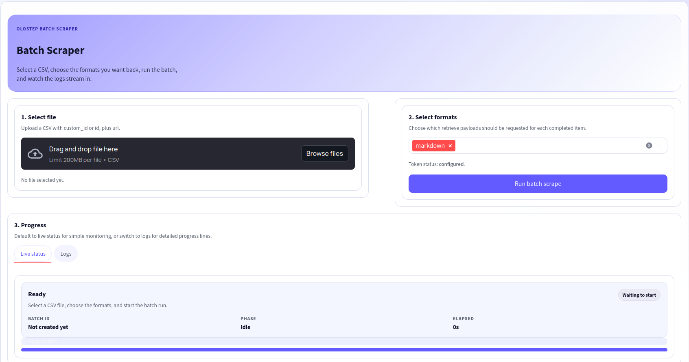

# Olostep Batch Web Scraper

Batch scrape website URLs from CSV with the [Olostep API](https://www.olostep.com/). This project provides both a Streamlit UI and a CLI for creating batches, polling progress, retrieving `markdown`/`html`/`json` content, and saving a single JSON output with completed and failed items.



## Why This Project

This project helps you:
- Process large URL lists from CSV in a single batch run.
- Keep every result mapped back to your own `custom_id`.
- Monitor live progress and logs in the Streamlit UI.
- Export one JSON payload with completed results and failed URLs.
- Use an [Olostep Parser](https://docs.olostep.com/features/structured-content/parsers) when you need structured extraction.

## Prerequisites

- Python 3.9+
- An [Olostep](https://www.olostep.com/) account with a valid API key or API token.

## Quick Start

Create and activate a virtual environment, then install dependencies:

```bash
python -m venv .venv
source .venv/bin/activate
pip install -r requirements.txt
```

Create `.env` in the project root:

```bash
OLOSTEP_API_KEY=your_olostep_api_key_here
```

This repo also accepts `OLOSTEP_API_TOKEN`. You can create an API key from the [Olostep API Keys dashboard](https://www.olostep.com/dashboard/api-keys).

Run the Streamlit UI:

```bash
streamlit run app.py
```

Or run the CLI:

```bash
python main.py --csv data/urls_sample.csv --out output.json --formats markdown
```

## What It Does

For each batch run, the workflow:
1. Reads a CSV with `custom_id` or `id`, plus `url`.
2. Creates a batch through [Olostep Batch](https://docs.olostep.com/features/batches/batches).
3. Polls the batch until processing completes.
4. Lists completed and failed items with cursor-based pagination.
5. Retrieves content for completed items from `/v1/retrieve`.
6. Writes a single JSON payload with batch metadata, results, and failed items.

## Run Modes

### Streamlit UI

Launch:

```bash
streamlit run app.py
```

UI includes:
- CSV upload.
- Retrieve format selection.
- Live batch status and progress.
- Streaming logs during batch execution.
- JSON download after the run completes.

### CLI

Default run:

```bash
python main.py --csv data/urls_sample.csv --out output.json
```

Example with additional options:

```bash
python main.py \
  --csv data/urls_sample.csv \
  --out output.json \
  --country US \
  --parser-id your_parser_id \
  --formats markdown,html
```

You can also pass the token directly:

```bash
python main.py --csv data/urls_sample.csv --out output.json --token "YOUR_TOKEN"
```

## Input CSV Format

Required columns:
- `custom_id` or `id`
- `url`

Example:

```csv
custom_id,url
heat-003,https://heat.gov/tools-resources/cdc-heatrisk-dashboard/
heat-004,https://heat.gov/tools-resources/extreme-heat-vulnerability-mapping-tool/
```

Sample file:
- `data/urls_sample.csv`

## Output JSON

The output file contains:
- `batch` and `batch_id` for the final Olostep batch object.
- `requested_count`, `results_count`, and `failed_count` summary fields.
- `results` with `custom_id`, `url`, `retrieve_id`, and retrieved content.
- `failed_items` for URLs returned as failed batch items.

If content is too large, Olostep may return `*_hosted_url` fields instead of inline content. Hosted URLs typically expire after about 7 days, so download what you need promptly.

### Example Output

```json
{
  "batch": { "id": "batch_...", "status": "completed" },
  "batch_id": "batch_...",
  "requested_count": 2,
  "results_count": 2,
  "results": [
    {
      "custom_id": "heat-004",
      "url": "https://...",
      "retrieve_id": "...",
      "retrieved": {
        "success": true,
        "size_exceeded": false,
        "markdown_content": "...",
        "markdown_hosted_url": null
      }
    }
  ],
  "failed_count": 0,
  "failed_items": []
}
```

## Common Options

- `--country`: Set the ISO 3166-1 alpha-2 country code such as `US` or `IN`.
- `--parser-id`: Use an [Olostep Parser](https://docs.olostep.com/features/structured-content/parsers) for structured extraction.
- `--poll-seconds`: Control the polling interval between batch status checks.
- `--formats`: Request `markdown`, `html`, or `json` from `/v1/retrieve`.
- `--items-limit`: Control page size for `/v1/batches/{batch_id}/items` pagination.
- `--log-every`: Log batch status every N polls in CLI mode.

## Project Structure

```text
.
├── app.py                  # Streamlit UI for CSV upload, progress, and JSON download
├── main.py                 # CLI entrypoint for batch runs
├── data/
│   └── urls_sample.csv     # Sample batch input file
├── src/
│   ├── batch_scraper.py    # Async client for batch and retrieve endpoints
│   └── batch_workflow.py   # CSV parsing, polling, retrieval, and payload helpers
├── requirements.txt        # Python dependencies
├── output.json             # Example output artifact
└── ui.png                  # UI preview image used in this README
```

## Olostep References

- [Olostep Documentation](https://docs.olostep.com/)
- [Olostep Batch Guide](https://docs.olostep.com/features/batches/batches)
- [Olostep Parsers Documentation](https://docs.olostep.com/features/structured-content/parsers)
